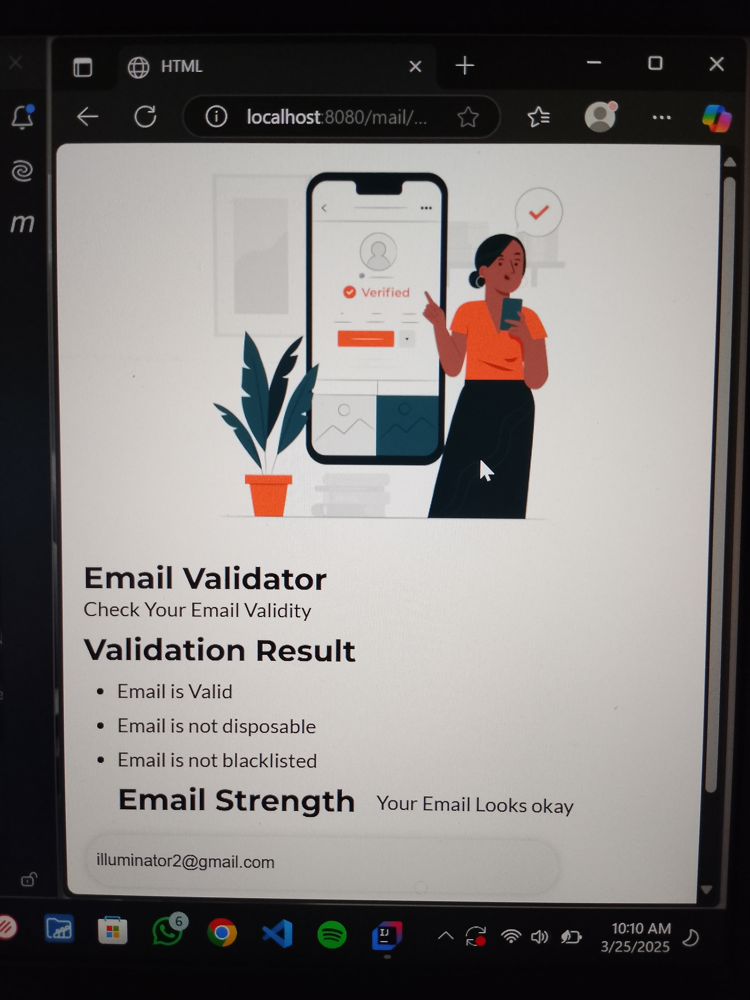

# 📧 Mail Validator API

A Spring Boot application for validating email addresses efficiently.

## 🚀 Features
- Validate email addresses using regex and other validation techniques.
- RESTful API with easy integration.
- Lightweight and scalable.
- Front-end built with **HTML, CSS, and JavaScript**.

## 📸 Screenshot


## 🛠️ Tech Stack
- **Java 17+**
- **Spring Boot**
- **Maven**
- **HTML, CSS, JavaScript** (for UI)

## 📦 Project Structure
```
📂 validator
 ┣ 📂 src
 ┃ ┣ 📂 main
 ┃ ┃ ┣ 📂 java/com/validator/test
 ┃ ┃ ┃ ┣ 📂 controller   # API Controllers
 ┃ ┃ ┃ ┣ 📂 dto          # Data Transfer Objects
 ┃ ┃ ┃ ┣ 📂 service      # Business Logic
 ┃ ┃ ┃ ┗ MailValidatorApplication.java  # Main Entry Point
 ┃ ┃ ┣ 📂 resources
 ┃ ┃ ┃ ┣ 📂 templates    # HTML Files
 ┃ ┃ ┃ ┃ ┗ index.html
 ┃ ┃ ┃ ┣ 📂 static
 ┃ ┃ ┃ ┃ ┣ 📂 css       # Stylesheets
 ┃ ┃ ┃ ┃ ┃ ┗ style.css
 ┃ ┃ ┃ ┃ ┗ 📂 js        # JavaScript Files
 ┃ ┃ ┃ ┃ ┃ ┗ main.js
 ┣ 📜 pom.xml           # Maven Configuration
 ┗ 📜 README.md         # Project Documentation
```

## 🚀 Getting Started

### 1️⃣ Clone the Repository
```sh
git clone https://github.com/your-username/validator.git
cd validator
```

### 2️⃣ Build & Run the Project
```sh
./mvnw spring-boot:run
```
Or for Windows:
```sh
mvnw.cmd spring-boot:run
```

### 3️⃣ API Usage
#### Validate an Email
```http
POST /validate
Content-Type: application/json

{
  "email": "test@example.com"
}
```

Response:
```json
{
  "valid": true,
  "message": "Valid email address"
}
```
---

💡 _Happy Coding!_ 🚀
